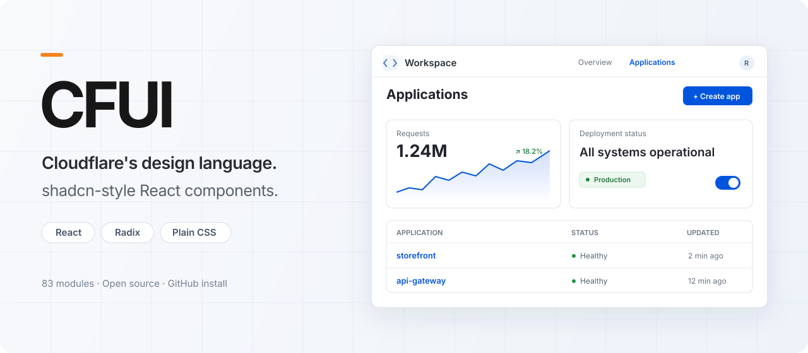

<p align="center">
  
</p>

# CFUI

**Cloudflare's design language, shadcn-style React components.**

We recreated the visual language of Cloudflare's dashboard as a simple UI library for building tools that look like they belong in Cloudflare. Familiar compound components, Radix primitives, and plain CSS give you the controls without a Tailwind setup.

CFUI is an independent, unofficial project. It is not affiliated with or endorsed by Cloudflare or shadcn/ui.

- **83 modules** for forms, navigation, overlays, tables, charts, dashboard surfaces, and messaging.
- **React 19 + TypeScript**, with native props, forwarded refs, and common shadcn-style composition.
- **Light and dark themes**, scoped component styles, CSS variables, and a locally served Inter font.
- **Install directly from GitHub.** Built ESM, declarations, CSS, and font assets are committed with each release; no package build scripts are needed to consume it.

[Getting started](docs/getting-started.md) · [Component inventory](INVENTORY.md) · [Contributing](CONTRIBUTING.md) · [Changelog](CHANGELOG.md)

## Install

Choose your package manager. These commands install the same tagged release; no npm registry publication is required.

```sh
# npm
npm install github:RussellBloxwich/cfui#v0.1.0

# pnpm
pnpm add github:RussellBloxwich/cfui#v0.1.0

# Yarn
yarn add github:RussellBloxwich/cfui#v0.1.0

# Bun
bun add github:RussellBloxwich/cfui#v0.1.0
```

Your application needs React 19 and React DOM 19. Pin a release tag or commit for reproducible installs.

## Use

Import the stylesheet once in your application's browser entry point:

```tsx
import "cfui/styles.css";
import { Button } from "cfui/button";

export function App() {
  return (
    <main className="cfui-theme">
      <Button onClick={() => console.log("Create application")}>
        Create application
      </Button>
      <Button variant="secondary" size="sm">Cancel</Button>
    </main>
  );
}
```

Root imports such as `import { Button, Input } from "cfui"` also work. Every module has a short entry like `cfui/dialog` and a long entry like `cfui/components/ui/dialog`. `cfui/components.css` is an alias for the stylesheet; import one stylesheet entry.

Compose controls the way you would with shadcn/ui:

```tsx
import {
  Button,
  Dialog,
  DialogTrigger,
  DialogContent,
  DialogHeader,
  DialogTitle,
  DialogDescription,
  DialogFooter,
  DialogClose,
} from "cfui";

export function CreateApplication() {
  return (
    <Dialog>
      <DialogTrigger asChild>
        <Button>Create application</Button>
      </DialogTrigger>
      <DialogContent>
        <DialogHeader>
          <DialogTitle>Create application</DialogTitle>
          <DialogDescription>Choose a name and configure your application.</DialogDescription>
        </DialogHeader>
        <p>Your application form goes here.</p>
        <DialogFooter>
          <DialogClose asChild>
            <Button variant="secondary">Cancel</Button>
          </DialogClose>
        </DialogFooter>
      </DialogContent>
    </Dialog>
  );
}
```

## Theme

The default palette is light, with the dashboard's blue action color and neutral surfaces. Put the theme on `<html>` so dialogs, menus, and other portaled content inherit it:

```html
<html data-cfui-theme="dark">
```

Use `className="cfui-theme"` on your application's typography root. Override `--cfui-*` CSS variables after the CFUI stylesheet to adapt the palette, fonts, or radii. See [theming](docs/getting-started.md#theming).

## What's included

| Area | Examples |
| --- | --- |
| Actions and forms | Button, Badge, Input, Field, Checkbox, Switch, Form |
| Selection and overlays | Select, Combobox, Command, Dialog, Sheet, Popover, Tooltip |
| Navigation | Tabs, Accordion, Breadcrumb, Sidebar, Toolbar, menus |
| Content and data | Card, Alert, Table, DataTable, Resizable, Calendar, Chart |
| Dashboard patterns | Banner, Surface, Meter, Code, NumberField, copy controls |
| Messaging | Attachment, Bubble, Message, MessageScroller, Questionnaire |

The 83-module count includes providers, hooks, and stores. The [inventory](INVENTORY.md) lists all modules and separates direct reference coverage from adaptations.

## Compatibility and scope

CFUI supports common shadcn-style APIs and Radix composition. It is a React package, rather than a shadcn registry installer, and does not promise every prop or behavior of every shadcn/ui or Base UI release. `Drawer` uses Radix Dialog with directional placement; swipe physics and snap points are not included.

The design foundation comes from observed Cloudflare dashboard styles. Components and states absent from those views are adaptations of that foundation. Dark tokens are based on dashboard CSS; this is not a claim of pixel-perfect parity across every Cloudflare screen or state.

## Explore and contribute

Clone the repository and run the gallery:

```sh
npm ci
npm run build:package
npm run gallery
```

The gallery opens at `http://127.0.0.1:8795/`. Use `?view=all` for the catalog and `?theme=dark` to explore the dark palette. Development requires Node.js 22.12 or newer.

Bug reports, focused improvements, and additional behavior tests are welcome. Read [CONTRIBUTING.md](CONTRIBUTING.md) before opening a pull request.

## License

[MIT](LICENSE). See [third-party notices](THIRD_PARTY_NOTICES.md) for dependency and asset attribution. The bundled Inter font is distributed under the [SIL Open Font License](dist/licenses/inter-OFL.txt). Cloudflare and shadcn/ui names belong to their respective owners.
